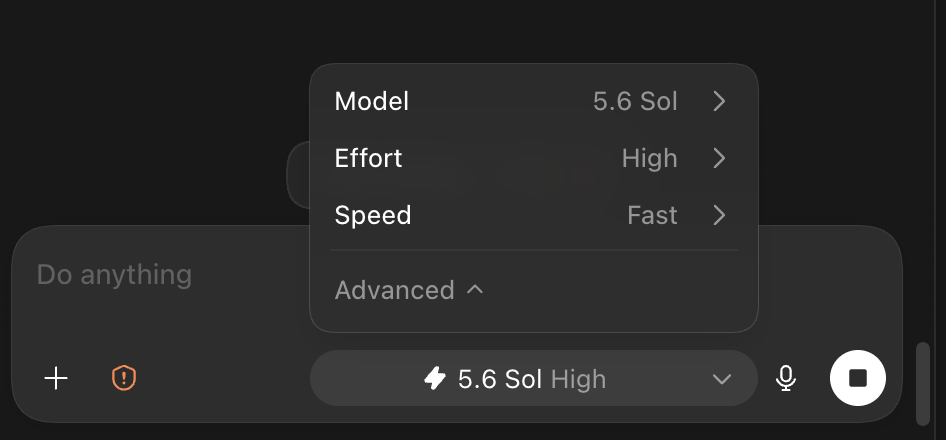
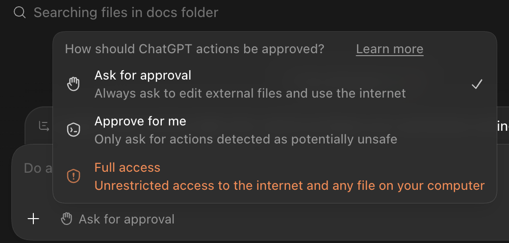
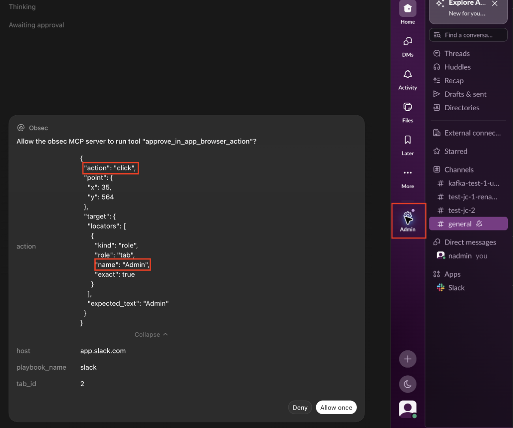
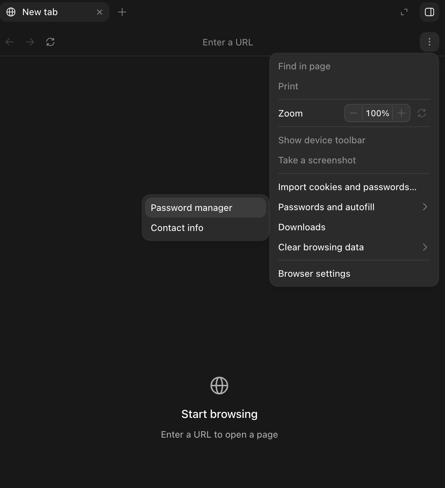
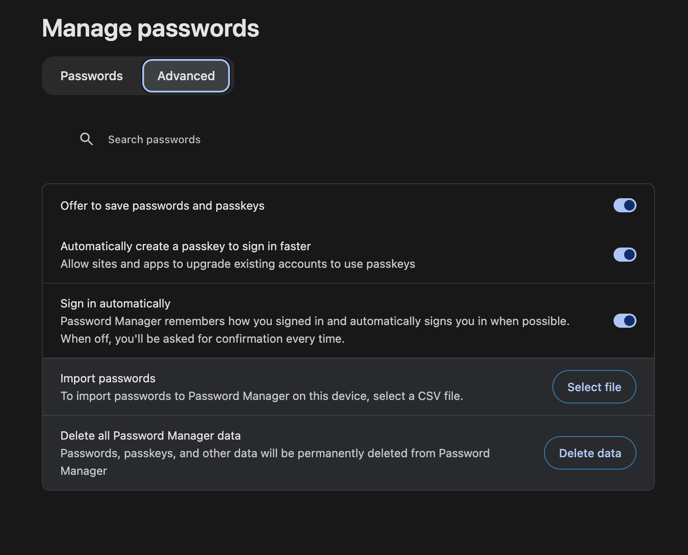

# ObSec Codex Plugin - End User Guide

The ObSec Codex plugin gives Codex guided workflows for inspecting SaaS security
posture and synchronizing the results with Obsidian Security.

## Prerequisites

- The ChatGPT desktop app with Codex and Plugins access.
- The Codex in-app Browser plugin enabled.
- Node.js 22 or newer available on `PATH`, or the Node.js runtime bundled with
  Codex.
- An Obsidian API server URL and API token.

## Install the plugin

Add the marketplace from a terminal:

```bash
codex plugin marketplace add \
  https://gitlab.com/obsec1/dataplatform/bastion-codex-public.git
```

Restart the ChatGPT desktop app. Open **Plugins**, choose **Obsidian Security
Plugins**, and install **Obsidian Security**. Start a new Codex task after an
install or upgrade.

## Connect to Obsidian Security

Set `OBSIDIAN_API_SERVER` and `OBSIDIAN_API_TOKEN` in the environment that
starts Codex. Keep the token out of prompts and shell commands. Exclude it from
Codex's shell environment in `~/.codex/config.toml`:

```toml
[shell_environment_policy]
exclude = ["OBSIDIAN_API_TOKEN"]
```

In a new task, open `/hooks` and trust the installed ObSec hook, then open `/mcp`
and confirm that the required `obsec` server initialized.

## Choose and configure a model

The plugin uses whichever model is selected in Codex; there is no separate
model configuration for ObSec. Select a model before starting the inspection.
The workflow reads live page snapshots from the Codex in-app Browser and does
not require image uploads.

Available models may depend on local or organizational policy.

{ width=82% }

\newpage

## Configure your permission settings

Use the permissions control below the composer to choose how Codex handles
actions that need access beyond the current workspace. For most inspections,
start with **Ask for approval**.

{ width=82% }

- **Ask for approval** - Codex works within the allowed workspace, while the
  guarded Browser workflow verifies the target and asks you to approve every
  click or other Browser change before it runs. Codex also pauses before editing
  external files or using the internet.
- **Approve for me** - Codex keeps the same workspace boundary, while the
  guarded Browser workflow still verifies and submits each Browser action
  separately. Eligible actions go to an automatic reviewer; anything that
  cannot be approved safely returns to you.
- **Full Access** - Codex runs without local sandbox restrictions or approval
  prompts and can access the internet and files outside the workspace. Use it
  only when that broad access is intentional. Browser action requests pass
  automatically without asking you.

\newpage

## Review a guarded Browser action

In **Ask for approval** mode, Codex displays an approval request before a
guarded Browser action runs. The request shows the proposed action, target,
host, and Browser tab. Compare these details with the visible application
before choosing **Allow once** or **Deny**.

{ width=80% }

In this example, the request proposes a `click` on the target named `Admin`.
The Browser cursor on the right, boxed in red, shows the exact UI control that
is awaiting permission. Confirm that the cursor, target name, and host all match
the intended action.

\newpage

## How to use Codex Password Manager

The Codex in-app Browser uses a separate browser profile with its own saved
logins. To open the password manager:

1. Open the three-dot menu in the upper-right corner of the Browser.
2. Select **Passwords and autofill**, then **Password manager**.

{ width=54% }

The same options are available under **Settings** > **Browser**. The Browser
menu also provides an option to import cookies and passwords from another
browser.

\newpage

### Save a password on your next login

In **Password manager**, open **Advanced** and turn on **Offer to save passwords
and passkeys**.

{ width=82% }

The next time you log in to a SaaS application, choose **Save** when the Browser
asks whether to save the password. The saved login will then be available for
future inspections. Return to **Password manager** to edit or delete it.

Do not paste passwords into chat. Complete password entry, SSO, MFA, CAPTCHA,
and other authentication steps in the visible Browser.

\newpage

## First posture inspection

Ask Codex to inspect the security posture of a SaaS application. For example:

> Capture the security posture settings from Acme SaaS.

You can provide a starting URL if the application is not easily discoverable.
The exact wording is flexible; the request should identify the application and,
when useful, the security settings or administrative area to inspect.

### Before the inspection

Make sure the Codex in-app Browser is available. If the SaaS application
requires authentication, sign in through the Browser or be prepared to complete
the login steps when Codex pauses.

Do not paste passwords, API tokens, cookies, recovery codes, or MFA codes into
chat. Complete SSO, MFA, CAPTCHA, or other human verification steps directly in
the Browser when requested.

### During the inspection

Codex navigates the visible application interface and reads the relevant
security settings. Respond to approval requests as they appear. If Codex cannot
locate a settings page, you can provide a link or describe where it should look.

### Review the results

Codex summarizes the settings it found, any settings that were inaccessible or
could not be found, and the page or section supporting each finding. A
successful inspection is saved locally so it can be reviewed or run again.

After reviewing the findings, the user can ask Codex to send the captured
settings to the Obsidian platform.

## Schedule recurring posture inspections

After completing an inspection, you can ask Codex to run it on a recurring
schedule and send the results to Obsidian. For example:

> Grab Slack posture settings every Tuesday at 5:00 PM and send them to my
> Obsidian platform.

Because scheduled inspections run without you present to approve each Browser
action, Codex will ask permission to enable unattended Browser approval for
that specific playbook. Setting up the application's credentials in Codex
Password Manager is encouraged so the Browser can remain signed in or reuse the
saved login.

After confirmation, Codex creates the schedule and reports its frequency and
next run. If the website is signed out or requires MFA or other user input, the
run stops and records the failure without replacing the last successful
settings. Successful results are sent to the connected Obsidian destination.
